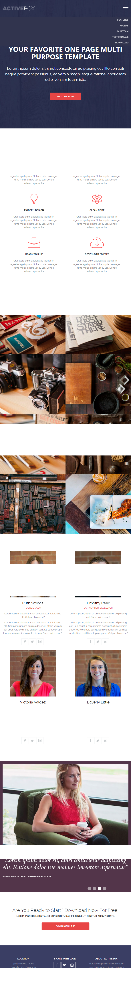
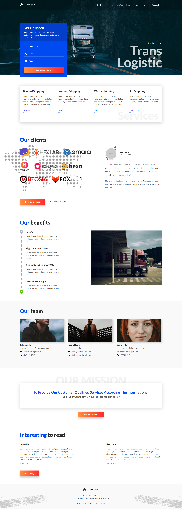
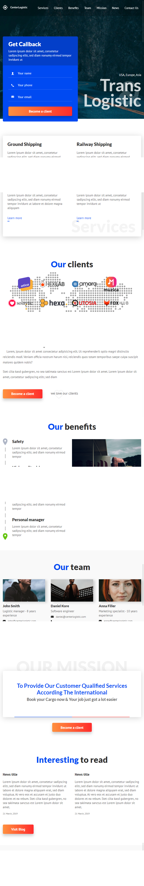
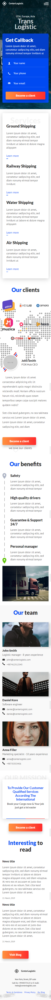
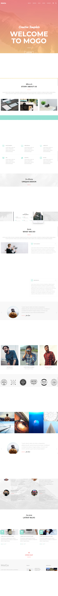
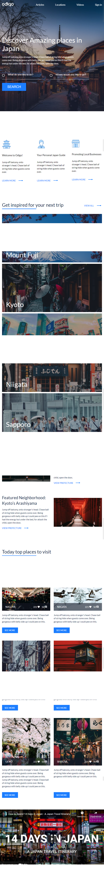
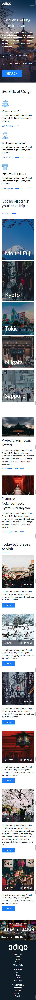

# Примеры сайтов, которые сверстал по макетам из Figma и PSD

1. [ActiveBox](#activeBox)
2. [Logistic](#logistic)
3. [Mogo](#mogo)
4. [Odigo](#odigo)
5. [Portfolio](#portfolio)

## Activebox

Одностраничный сайт, адаптированный под мобильные устройства. Есть скрывающееся меню и применен слайдер изображений.

<b>HTML/CSS/Slick Slider</b>

## Logistic

Сайт транспортной компании. Реализованы отдельные страницы, показ модальных окон, слайдеры, бургер-меню, быстрый переход к раделам и прочее.

<b>HTML/CSS/JQuery</b>

## Mogo
Одностраничный сайт, адаптированный под мобильные устройства. Есть скрывающееся меню и применен слайдер изображений.

<b>HTML/CSS/Slick Slider</b>

## Odigo
Одностраничный сайт о турах в Японии, адаптированный под мобильные устройства. Есть скрывающееся меню, вствлалено видео с YouTube. реализована анимация некоторых объектов на CSS.

<b>HTML/CSS</b>

## Portfolio
Одностраничный сайт портфолио. Реализовано бургер-меню, модальные окна, сортировка проектов

<b>HTML/CSS/JQuery</b>

